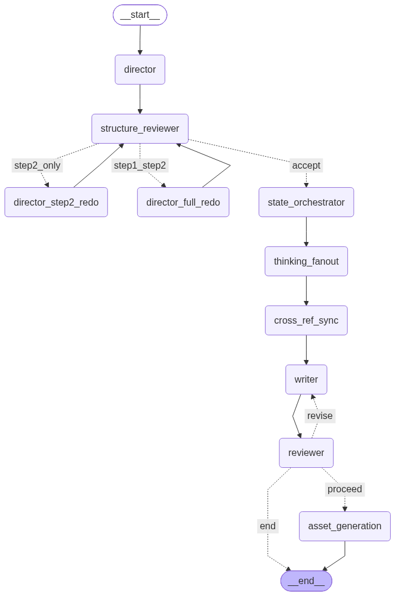

# VN-Agent

**Multi-Agent AI Visual Novel Generator** — from a one-line theme to a fully playable [Ren'Py](https://www.renpy.org/) project with branching storylines, transparent-background character sprites, 16:9 scene backgrounds, and BGM.

**多 Agent 协作的 AI 视觉小说生成器** — 一行主题到可直接在 Ren'Py 上运行的完整游戏：分支剧本、透明底立绘、16:9 场景背景、BGM。

---

## The pipeline / 流水线

A LangGraph state machine, not a single prompt. Ten nodes, with two revision
loop-backs from the structure reviewer:



> Regenerate with `PYTHONPATH=src python scripts/dump_langgraph_diagram.py`
> — the diagram is derived from the compiled graph, so it cannot drift from
> the code.

---

## What v4 adds / v4 新增能力

v1–v3 built the generation pipeline. v4 turned it into a product — a workbench
a creator can actually sit in front of.

| 方向 | 做了什么 | 为什么 |
|---|---|---|
| **多源素材融合** | 上传文档 / 联网检索 / 本地开源素材库 / LLM 生成，四通道融合，跨源去重（pHash + embedding），版权白名单 gate | 直面「AI 生成内容同质化」——非 LLM 素材占比可量化 |
| **数据飞轮** | 👍/👎 反馈落 JSONL → BM25 检索注入 Writer few-shot → Reflection Agent 提炼元规则 | AI Ops 闭环：用户反馈真的回流到下一次生成 |
| **Chat Ops** | 意图分类器 → 意图预览卡片 → 确认后执行；改写场景 / 加角色 / 改素材 | 从「提交后等一条流水线跑完」变成「任意节点介入」 |
| **PlaytestAgent + Vision Judge** | 自动遍历分支、合成代表帧、喂 Vision LLM 打 6 个维度 | 评测从「离线跑分」变成「发布前一键体检」 |
| **Autopilot** | 一句话主题 → 零点击 → 直接进播放器 | 完整 demo 闭环 |
| **P6 工作台改版** | 流水线实时可视化、故事板、形态驱动布局、中英双语 | 把产品最值钱的东西（多 Agent 协作）从不可见变成主舞台 |

**工作台界面**（`npm run dev` 后访问 `localhost:5173`）：流水线剧场实时点亮每个
Agent 节点、场景卡片网格、卡片内改写、全幅播放器、中英实时切换。

---

## Docs / 文档导航

**当前生效（v4，2026-07-08 起）**：

| 文件 | 内容 |
|---|---|
| [docs/v4/PRODUCT_v4.md](./docs/v4/PRODUCT_v4.md) | **v4 产品北极星** — 工作台形态、5 大方向、AI PM 校招叙事 |
| [docs/v4/README_v4.md](./docs/v4/README_v4.md) | v4 目录导航 + 与 v1–v3 的关系 |
| [docs/v4/FRONTEND_REDESIGN_v4.md](./docs/v4/FRONTEND_REDESIGN_v4.md) | P6 工作台改版设计稿 — 问题定义、形态跟随状态、视觉系统、六层迁移策略 |
| [docs/v4/SHOWCASE_v4.md](./docs/v4/SHOWCASE_v4.md) | 现场 demo 运行手册 — 零花费启动、演示动线、故障预案 |
| [docs/v4/RESUME_BRIEF_v4.md](./docs/v4/RESUME_BRIEF_v4.md) · [_CN](./docs/v4/RESUME_BRIEF_v4_CN.md) | 事实清单：每条声明都带 commit / 文件路径，并明确区分「已实测」与「仍是目标值」 |

**持续更新的工程/审计文档**：

| 文件 | 内容 |
|---|---|
| [docs/DESIGN_DECISIONS.md](./docs/DESIGN_DECISIONS.md) | 关键决策的"为什么" |
| [docs/AUDITS.md](./docs/AUDITS.md) | 已知技术债 + 未完成修复分析 |
| [docs/ARCHITECTURE.md](./docs/ARCHITECTURE.md) | 长期架构路线（四通道 RAG / 自我进化 Agent / Ren'Py 表现力） |
| [docs/CHANGELOG.md](./docs/CHANGELOG.md) | 每日 commit 流水（pre-commit hook 自动追加） |

**🔒 SHELVED（保留但搁置，v1–v3 时代）**：

| 文件 | 内容 |
|---|---|
| [docs/PRODUCT.md](./docs/PRODUCT.md) | v1–v3 产品需求（Phase 1–13 里程碑） |

历史开发日志归档在 `docs/archive/DEV_LOG_legacy.md`（2026-04-23 切分前的内容）。
v2/v3 时代的 SHOWCASE 与面试口径在 `docs/v2/` 和 `docs/v3/`（仍可用于校招）。

---

## Architecture / 架构

```
User: "A lighthouse keeper must choose between saving a ship or abandoning the post"
用户：「一位灯塔看守人必须在救船与弃塔之间做选择」
                                    │
                           ┌────────▼─────────┐
                           │     Director     │  ← 2-step planning (outline → navigation)
                           │   (CoT reasoning)│     两步规划，防止 max_tokens 截断
                           └────────┬─────────┘
                                    │
                           ┌────────▼─────────┐
                           │ StructureReviewer│  ← pre-Writer outline audit
                           └────────┬─────────┘    (branch intent, arc shape)
                                    │
                           ┌────────▼─────────┐
                           │ StateOrchestrator│  ← world_state → narrative constraints
                           │  (Haiku, cheap)  │    (Sprint 9-6 logic decouple)
                           └────────┬─────────┘
                                    │
                     ┌─────────────►│
                     │     ┌────────▼─────────┐
                     │     │     Writer       │  ← RAG few-shot + state constraints
                     │     │  (Sonnet craft)  │
                     │     └────────┬─────────┘
                     │              │
                     │     ┌────────▼─────────┐
                     │     │  DialogueReviewer│──── revision loop (max 3 rounds)
                     │     │  Python pre-gate │     修订循环，上限 3 轮
                     │     │  + Sonnet judge  │
                     │     └────────┬─────────┘
                     │              │ PASS
                     │   ┌──────────┼──────────┐
                     │   │          │          │     asyncio.gather
                     │   ▼          ▼          ▼     (parallel + fault isolation)
                     │ Character  Scene     Music
                     │ Designer   Artist    Director
                     │   │          │          │
                     │   └──────────┼──────────┘
                     │              │
                     │     ┌────────▼─────────┐
                     └────►│  Ren'Py Compiler │  → Playable game project
                           │  + rembg cutout  │
                           │  + PIL BG resize │
                           └──────────────────┘
```

**Key design decisions / 关键设计决策:**
- **Agent decomposition / Agent 拆分**: each agent owns one decision domain (planning / writing / review / visuals / music); merging them causes prompt scaling + JSON instability. 每个 Agent 独占一个决策域，合并会触发 prompt 膨胀与 JSON 输出不稳定。
- **Symbolic world state (Sprint 9) / 符号化世界状态**: `world_variables` + `state_reads` / `state_writes` + Ren'Py `$ var` emission — state evolves across scenes, not hallucinated. 状态跨场景演化，不由 LLM 幻觉。
- **Creator mode (Sprint 12-3) / 创作者模式**: `--pause-after outline` dumps sidecar; edit `vn_script.json` on disk; `continue-outline` resumes with writer-only graph. 大纲落盘可编辑，续跑只走下半程图。
- **Conditional revision loop / 条件修订循环**: Reviewer↔Writer with Python mechanical pre-gate (format / keywords / state) then Sonnet craft check; hard cap 3 rounds. 纯 Python 机械 gate 先把关，Sonnet craft 后置；上限 3 轮防死循环。
- **Parallel asset generation / 并行资产生成**: Character/Scene/Music have no data deps → `asyncio.gather` with `return_exceptions=True` for fault isolation. 三个资产 Agent 无依赖，并行执行带故障隔离。

---

## Tech Stack / 技术栈

| Layer / 层 | Technology |
|---|---|
| Agent orchestration / Agent 编排 | LangGraph `StateGraph`, conditional edges, writer-only subgraph for creator-mode continue |
| LLM providers / LLM 供应商 | Anthropic Claude / OpenAI GPT / Google Gemini / Ollama local (provider auto-routing by model prefix) |
| RAG retrieval / RAG 检索 | sentence-transformers + FAISS `IndexFlatIP` + BM25 weighted RRF fusion (1,036 annotated corpus) |
| Structured output / 结构化输出 | LLM tool calling (Pydantic schema → function definition) |
| Image generation / 图像生成 | Google Nano Banana (Gemini 2.5 Flash Image) primary + OpenAI gpt-image-1 / Stability fallback chain, aspect ratio plumbing (3:4 sprites, 16:9 BGs) |
| Sprite cutout / 立绘抠图 | rembg u2net_human_seg local ONNX inference → transparent-background PNG (optional `[cutout]` extra) |
| Quality assurance / 质量保证 | Cross-model judge (Sonnet + GPT-4o) + 5-dim rubric + BFS reachability + persona fingerprint drift audit |
| Cost optimization / 成本优化 | Multi-model routing + prompt caching (Anthropic ephemeral) + per-job TokenTracker |
| Web API / Web 接口 | FastAPI async + SQLite job store + SSE streaming |
| CI/CD | GitHub Actions (ruff + mypy + 947 pytest + coverage ≥60%) + Docker |

---

## Quick Start / 快速开始

```bash
# Install / 安装 (requires uv: https://docs.astral.sh/uv/)
uv sync --all-extras    # --extra cutout pulls rembg for transparent sprites

# Configure API keys / 配置密钥
cp .env.example .env
# Edit .env → set ANTHROPIC_API_KEY, GOOGLE_API_KEY (for Nano Banana), OPENAI_API_KEY (for cross-judge)

# Generate a visual novel / 生成一部 VN
vn-agent generate "A lighthouse keeper during a catastrophic storm" --output ./my_vn

# Creator mode: pause after outline to edit manually
# 创作者模式：大纲生成后暂停，手改 vn_script.json 再继续
vn-agent generate "..." --output ./my_vn --pause-after outline
# (edit ./my_vn/vn_script.json, then)
vn-agent continue-outline --output ./my_vn

# Regenerate one scene without re-running pipeline
# 只重写单个场景，不跑全流程
vn-agent regen ch3_the_choice --output ./my_vn --feedback "more subtext"

# Or use a local Ollama model (zero API cost)
# 或切本地 Ollama 模型（零 API 成本）
# Edit config/settings.yaml → set base_url: http://localhost:11434/v1
vn-agent generate "..." --output ./my_vn
```

### Other commands / 其他命令

```bash
vn-agent dry-run "..."                # Preview + cost estimate, no API calls
                                      # 预估 + 成本，不调 API
vn-agent generate "..." --mock         # Offline mode with canned fixtures
                                      # 离线 mock 模式
vn-agent validate ./out/vn_script.json # Validate generated script
                                      # 校验脚本
vn-agent compile ./out/vn_script.json --output ./out --characters ./out/characters.json
                                      # Re-compile Ren'Py project only
                                      # 仅重编 Ren'Py 项目
vn-agent eval strategy --corpus data/final_annotations.csv --mock
                                      # Run strategy classification eval
                                      # 运行策略分类评估
```

---

## Evaluation / 评估数据

### Cross-model judge agreement (Sprint 8-5 rejudge) / 跨模型判分一致性

47 paired scenes across 8 sweep cells, commit `4f1228f`. Refutes the "self-judging echo chamber" critique.
47 个配对场景覆盖 8 个 sweep cell — 直接反驳"自评自答"批评。

| Metric | Value |
|---|---|
| Sonnet mean / Sonnet 均值 | 3.68 |
| GPT-4o mean / GPT-4o 均值 | 3.66 |
| Pearson r | **0.643** |
| ±1-point agreement / ±1 分一致率 | **87%** |

### Mode comparison (8-cell sweep) / 模式对比

| Mode / 模式 | Score | Cost / 成本 |
|---|---|---|
| **literary** (ours) — physics-framework system prompt, zero-shot | **4.17** | ~$0.50 |
| action — raw VN few-shot injection | 3.92 | ~$0.50 |
| baseline_self_refine (single model, self-critique) | 3.45 | ~$0.15 |
| baseline_single (single Sonnet call) | 3.25 | ~$0.05 |

Multi-agent pipeline beats best baseline by +0.72 absolute — complexity earns its cost.
多 Agent pipeline 相对最强 baseline +0.72 绝对分，复杂度值回票价。

### Full-run cost / 完整运行成本

- Showcase demo (Three Hours Before the Tide, 6 scenes / 3 chars / 15 images): **$1.7 / ~30 min** full generate
- Continue-outline only (creator workflow): **$0.46 / ~9 min**（仅下半程 Writer+Reviewer+Assets）

---

## What's in the Ren'Py output / Ren'Py 输出什么

- Scene backgrounds **resized to exact 1920×1080** via PIL LANCZOS at save time — no black bars on any screen. 场景背景保存时强制 1920×1080，任何屏幕无黑边。
- Full-color 3:4 portrait sprites with **transparent alpha** (rembg u2net_human_seg), **9 emotion names aliased** to 3 generated PNGs with filesystem-aware fallback (drop `thoughtful.png` in the sprite dir → next recompile picks it up automatically). 全彩 3:4 立绘带真透明，9 种情感别名到 3 张生成图，创作者后期补图自动生效。
- `zoom 0.45` self-contained ATL transforms for left/center/right positions — industry-standard 49% screen-height sprite framing (Umineko / Fata Morgana / Never7). 三位置独立 ATL transform，行业标准 49% 屏高。
- Dialogue box styled via `define gui.*` on stock Ren'Py `say` screen (dark 80% alpha textbox, gold speaker name, 1560px wrap, punctuation-aware typewriter). 深色半透明对话框 + 米金色说话人名 + 标点节奏 typewriter。
- Floating center-screen choice menu with 50% scene dim (branches don't live inside the textbox). 分支选择浮窗中央大按钮，50% 黑蒙。
- Symbolic world-state emission: `default met_suspect = False` + `$ met_suspect = True` inside scene labels + `menu if met_suspect:` branch guards. 符号化状态 → Ren'Py `$ var` + `if` guards。
- **Long-form 50+ scene production-grade runs** (Phase 13-1): Anthropic key pool with exp backoff + Haiku/Sonnet split, async chapter rollup (flat index, dynamic 200–800 word, pinned scenes preserved), Director-declared `context_deps` graph with backward-only validation, 1-hour prompt-cache prefix (monolithic, ≥2048 token), SHA1 summary cache dedup, `state_timeline` with hard-truncate on local_regen. Short 6-scene demos remain unaffected (gating thresholds). 长篇 50+ scene 生产级支撑 — key pool、异步章节 rollup、叙事图、1h 缓存前缀、state 硬截断；短 demo 向下兼容。

---

## Project Structure / 项目结构

```
src/vn_agent/
├── agents/              # LangGraph nodes
│   ├── graph.py         # Full graph + build_writer_graph (creator-mode continue)
│   ├── director.py      # 2-step planning + Director checkpoint
│   ├── structure_reviewer.py
│   ├── state_orchestrator.py   # world_state → narrative constraints
│   ├── writer.py        # literary / action dual-mode + per-scene snapshot
│   ├── reviewer.py      # Python pre-gate + Sonnet judge
│   ├── character_designer.py   # sprite gen + rembg cutout + emotion batch
│   ├── scene_artist.py  # BG gen + PIL 1920×1080 resize
│   ├── music_director.py
│   ├── local_regen.py   # single-scene rewrite (Sprint 12-4)
│   └── unknown_chars.py # creator-mode resolver payload (Sprint 12-5)
├── compiler/
│   ├── renpy_compiler.py    # Jinja2 env + renpy_safe filter + emotion-map
│   ├── project_builder.py   # directory layout + placeholder fallback
│   └── templates/*.j2       # init / gui / script / characters
├── eval/                # Strategy metrics + corpus loader + lore index
├── observability/       # Trace spans, per-agent tokens
├── schema/              # Pydantic models + emotions.py single-source
├── services/            # LLM client + image_gen (4 providers) + bg_remove + token_tracker
├── web/                 # FastAPI + SSE + SQLite job store
├── cli.py               # Typer: generate / continue-outline / regen / eval / ...
└── config.py            # pydantic-settings + YAML + coupled sprite/BG knobs
tests/                   # 947 pytest cases across 20+ test modules
```

---

## Development / 开发

```bash
uv run pytest -m "not slow"                         # 947 tests pass
uv run ruff check src/ tests/                       # Lint
uv run mypy src/vn_agent/ --ignore-missing-imports  # Type check (clean)
uv run pytest --cov=src/vn_agent --cov-report=term  # Coverage (66%)
```

CI (`.github/workflows/ci.yml`) runs ruff + mypy + pytest + coverage floor 60% on every push.

---

## Documentation / 文档

- [Development Log / 开发日志](docs/archive/DEV_LOG_legacy.md) — sprint-by-sprint record (archived 2026-04-23)
- [Product Spec / 产品文档](docs/PRODUCT.md) — status, metrics, roadmap

---

## License

MIT
