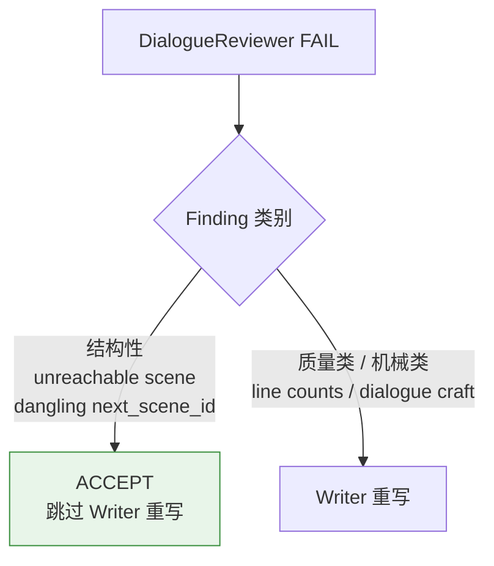
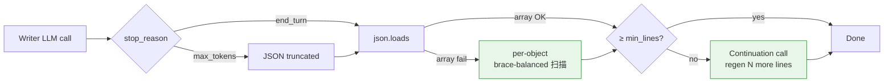
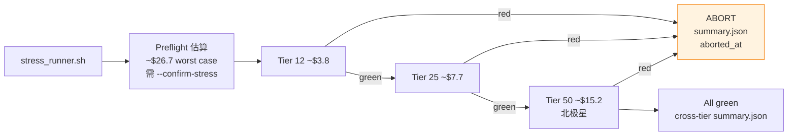
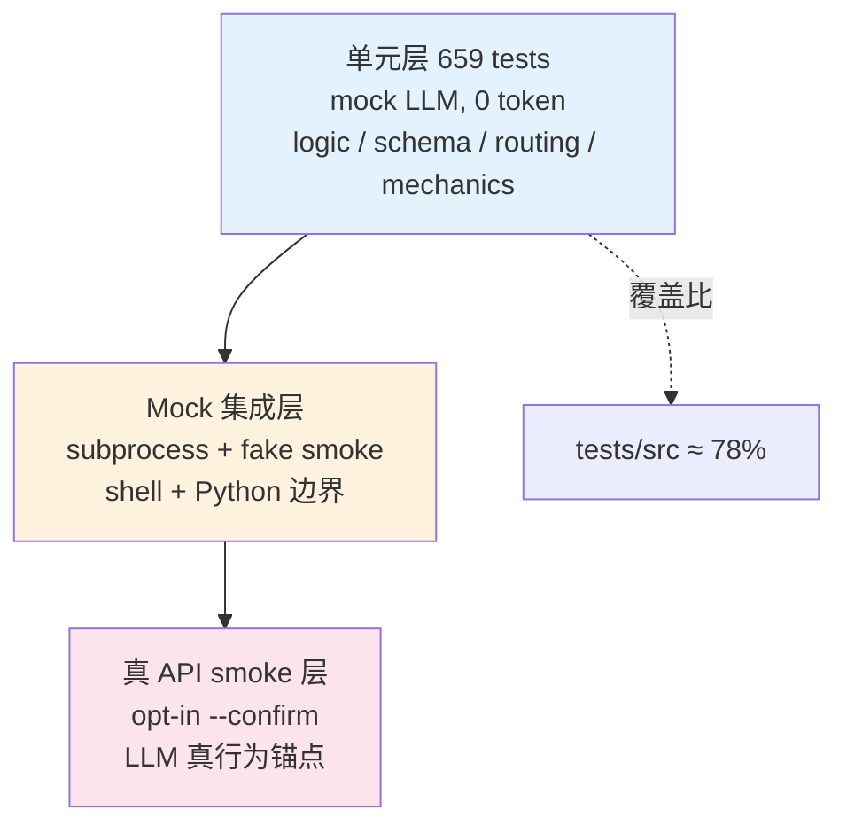

# VN-Agent

> 用一行命令把"故事主题"自动转换为"可玩 Visual Novel"的端到端引擎 —— LLM 多 Agent 流水线，输出 Ren'Py 工程（含立绘、背景、BGM 与可读中间格式）。

[](./tests)
[](./pyproject.toml)
[](./src/vn_agent/agents/graph.py)

---

## 1. 项目定位

**一句话**：输入主题文本 → 输出可直接编译运行的 Visual Novel（剧本、立绘、背景、BGM、Ren'Py 工程结构齐全）。

VN-Agent 解决的是创作者面临的一个具体问题：写一部交互式 Visual Novel 需要同时具备文学创作能力、分支结构设计能力、立绘与场景美术资源、配乐编排，以及 Ren'Py 等引擎的工程实现知识。本项目把这条路径拆解为多个专门 Agent 协作的流水线，让创作者只需提供一个故事主题即可获得完整可玩的作品，并通过 JSON 中间格式保留创作者后续手动调整的空间。

**北极星指标**（量化、生产级）：

| 指标 | 目标 | 现状 |
|---|---|---|
| 50+ scene 长篇 VN 端到端 | wall ≤ 30 min | 6-scene baseline 38 min；50-scene **编排已 mock 零成本验证**（2026-08-20，chapters/state_timeline/waves/并发全过），真实 API 墙钟待 M1 阶梯验证 |
| 总 API 成本（50 scene） | ≤ $15 | 实测外推区间 $13–$19，M1 验证中（mock 验证不产生成本数据） |
| 提示缓存命中率 | `cache_read_ratio` ≥ 0.5（scene 10+） | 通路已搭建，长篇真跑后产出数据 |
| 短篇 6–10 scene 向下兼容 | 不退化 | ✅ M0 + 两次 mini smoke 全程验证 |

**技术栈**：Python 3.11 · LangGraph · Pydantic · Anthropic Claude (Sonnet 4.6 + Haiku 4.5) · Google Gemini Nano Banana · FAISS + sentence-transformers · Ren'Py · Jinja2 · FastAPI

**当前状态**（2026-04-26）：170 commits · 15.8K LoC src · 12.4K LoC tests · **659 单元测试通过** · 已完成 3 次真 API smoke 验证。

---

## 2. 演示价值

```bash
$ vn-agent generate "灯塔守夜人面对潮汐三小时的回忆与责任" \
                   --max-scenes 6 --text-only --output ./out

[1/6] Director 规划 (outline + characters + world variables)
[2/6] StructureReviewer 审核 (deterministic + LLM narrative audit)
[3/6] Writer 逐场景对白生成 (Tool Use 结构化输出 + parallel)
[4/6] DialogueReviewer 三层审核 (structural / mechanical / 5-dim quality)
[5/6] Asset gen (CharDesigner + SceneArtist + MusicDirector, 并行)
[6/6] Ren'Py 编译

✅ 6 scenes / 3 characters / 4 BGM cues / wall 38 min / $2.04
   - ./out/                       # 可直接 renpy 启动的工程
   - vn_script.json               # 人类可读、可编辑的剧本
   - run_metrics.json             # cost / cache / wall / health 全审计
   - rag_retrievals.jsonl         # 每 scene 检索决策审计
```

输出可直接进 Ren'Py SDK 启动；中间产物 JSON 让创作者按需编辑后重编译。整套流水线被设计为**短篇与长篇通用**：6-scene demo 和 50-scene 长篇用同一套 Agent 框架，差异只在配置（chapter rollup 阈值、parallel 度、scene-type 自适应预算等长篇专属开关默认按 scene 数量自动启用）。这样既不让短篇 demo 被长篇所需的复杂记忆管理拖慢，也不让长篇被短篇假设的"全部上下文塞进一次 prompt"卡死。

---

## 3. 核心架构

```mermaid
flowchart LR
    User([Theme]) --> Director
    Director -->|outline| StructureReviewer[StructureReviewer<br/>deterministic + LLM]
    StructureReviewer -->|step1/step2 retry by category| Director
    StructureReviewer -->|accept| StateOrch[StateOrchestrator<br/>Haiku, world_state → constraints]
    StateOrch --> Thinking[Thinking Fanout<br/>per-scene plan]
    Thinking --> Writer[Writer<br/>Sonnet, wave-barrier parallel]
    Writer --> DialogueReviewer[DialogueReviewer<br/>3-layer: struct + mechanical + 5-dim quality]
    DialogueReviewer -->|FAIL: dialogue-class| Writer
    DialogueReviewer -->|FAIL: graph-class| Accept[Skip Writer rev<br/>routing optimization]
    DialogueReviewer -->|PASS / max_revs| Assets
    Assets[Asset Gen<br/>CharDesigner + SceneArtist + MusicDirector] --> Compiler[Ren'Py Compiler<br/>Jinja2 templates]
    Compiler --> Output([Ren'Py project])

    classDef agent fill:#e3f2fd,stroke:#1976d2
    classDef reviewer fill:#fff3e0,stroke:#f57c00
    classDef accent fill:#e8f5e9,stroke:#388e3c
    class Director,Writer,Assets,Compiler agent
    class StructureReviewer,DialogueReviewer reviewer
    class Accept accent
```



**关键设计**：narrative work 分配给 Sonnet 4.6（Director / Writer / Reviewer / Thinking），translation work 分配给 Haiku 4.5（StateOrch / Summarizer / Asset Agents）；模型分级有 8-cell baseline sweep 数据支撑（multi-agent 4.17 vs baseline_single 3.25 craft 评分，跨模型 GPT-4o judge 验证 Pearson r=0.643）。两个 Reviewer 在时间序上不可换位 —— StructureReviewer 看的是尚未生成对白的 outline，DialogueReviewer 看的是含完整对白的脚本，物理上不能合一。

---

## 4. 技术亮点

### 4.1 多 Reviewer 智能路由（按 finding 类别分发修复责任）



Reviewer 发现的问题不全是 Writer 能修的——例如"场景图不可达"是拓扑问题，Writer 只生成对白、无法修改 `next_scene_id`，盲目重写造成无收益的修复循环。

DialogueReviewer 引入 `can_writer_fix` 字段，对结构性 finding 标 `False`，graph 路由层据此跳过 Writer 重写。在 mini smoke #1 实测，6-scene baseline 节省 ~$1.10 / run（避免 2 次无效 Writer rev × 3 scenes）。

**位置**：`src/vn_agent/agents/reviewer.py:30` (`ReviewResult.can_writer_fix`) · `src/vn_agent/agents/graph.py:130` (`_should_revise`) · commit [`8a2ac88`](#)

### 4.2 结构化输出 + 三层 Writer 恢复链



Director step2 用 Anthropic Tool Use 直接产 Pydantic schema 验证后的 `DirectorStep2Output`，避免 raw text JSON 截断问题。Writer 层有更复杂的恢复链：主调截断 → JSON array 解析 → per-object 扫描提取已完整对话行 → continuation 补齐到 `min_dialogue_lines`。

实测：6-scene M0 run 中 16/18 主调命中 max_tokens，全部通过这条恢复链救活，最终 100% scenes 产出 ≥ 5 行对话。这条恢复链的设计哲学是把"LLM 输出不规整"当成日常情况而非异常 —— 不让单次失败把整个 pipeline 拖死，但每次走 fallback 路径都打 INFO log，让后续基于真数据评估是否要回到 prompt 层根本解决。

**位置**：`src/vn_agent/schema/script.py:418` · `src/vn_agent/agents/writer.py:_parse_dialogue` · commits [`05db6d8`](#) (Tool Use) + [`441fbc6`](#) (per-object fallback)

### 4.3 Token / cache / API 韧性全程可观测

每个 LLM 调用通过 `TokenTracker` 记录 input / output / cache_read_input / cache_creation_input tokens，按 Anthropic 实际计费规则（read 10% / create 125%）累计成本，per-job 通过 `ContextVar` 隔离并发安全。

`run_metrics.json` 写入完整审计字段：

```json
{
  "wall_seconds": 1229.3, "wall_minutes": 20.49,
  "scene_count": 3, "total_cost_usd": 1.13,
  "cache_read_ratio": 0.0, "key_rotation_count": 5,
  "health_status": "red",
  "degradation_signals": [
    "key_rotation_density=5/3 > 1.0 — sustained 429 pressure observed",
    "wall_minutes=20.49 > 2x expected (1.5) — runtime degradation"
  ]
}
```

50-scene 长跑的成本与稳定性可在跑后即刻审计；M1 stress runner 的阶梯 abort 决策直接读这些字段。

**位置**：`src/vn_agent/services/token_tracker.py` · `src/vn_agent/services/llm.py:_log_stop_reason` · commit [`fab853d`](#) (cache 字段补全)

### 4.4 Anthropic Key Pool + 健康信号

API 韧性三层防御：
- **Key Pool round-robin**（Sonnet / Haiku 分池）+ per-key cooldown，单 key 429 自动切换
- **指数退避 + jitter**（tenacity）覆盖瞬态 5xx
- **Health gate**（`smoke_longvn.py:_compute_health_signals`）：`retry > 5` / `key_rotation_density > 1.0` / `wall_minutes > 2× expected` 任一触发 red，配合 `--abort-on-degradation` 让 stress runner 在 cheap tier 失败时立即 abort 后续 expensive tier。

**位置**：`src/vn_agent/services/llm.py:_pool_for` · `scripts/smoke_longvn.py:109` · commit [`745e03d`](#) (health gate 设计)

### 4.5 RAG 注入与 audit trail

世界观 / 角色档案 / 场景背景作为"实体级 RAG"注入：always-scope 内容（premise + 主角档案，~2K tokens）走 prompt cache 永驻；per-scene 检索 top-k=4 个 entity 注入当前 scene。

每次检索决策写入 `rag_retrievals.jsonl`（per scene 一行：query / retrieved_ids / similarity scores），让"为什么 ch3 提到了不该提的角色"从黑盒变成可调试问题。

**位置**：`src/vn_agent/eval/lore.py` · `src/vn_agent/agents/writer.py` (lore injection)

### 4.6 阶梯化 stress runner（M1 交付）

`scripts/stress_runner.sh` 顺序跑 12 → 25 → 50 scene 三档：



每 tier 跑完读 `health_status`，red 立即 abort，避免 50-scene 在已知有问题的配置下烧 ~$15。`set -o pipefail` + 双重检查（python exit code + JSON 字段）确保 abort 信号传递不丢，这条工程教训来自更早一次手动验证中观察到的 shell pipeline 退出码被 `tee` 吞掉的实例 —— 在 harness 里把这类经验直接编码进默认行为。

测试通过 `VN_SMOKE_SCRIPT` 环境变量注入 fake smoke，覆盖 dry-run / 全 green / red 中段 abort / red 起点 abort / metrics 缺失等路径，0 token 验证 orchestration 逻辑。

**位置**：`scripts/stress_runner.sh` · `tests/test_scripts/test_stress_runner.py` · commits [`16515d5`](#), [`cfec1cb`](#), [`dac5e69`](#)

---

## 5. 测试策略



- **单元层** 覆盖逻辑层变化（schema / routing / mechanics），秒级回归，CI 默认全跑
- **Mock 集成层** 覆盖 shell + Python 边界（POSIX CI 跑通；Windows + Git Bash 路径转换平台限制 skip）
- **真 API smoke 层** opt-in，捕获 LLM 真行为变化（模型升版、cap 行为、429 模式）——单元测试看不见的部分

---

## 6. 项目数据

| 项 | 数 |
|---|---|
| Total commits | 170 |
| src Python LoC | 15,851 |
| tests Python LoC | 12,382 |
| 单元测试 | **659 passed**（11 platform-skipped）|
| 真 API smoke 验证 | 3 次（M0 + 2 次 mini regression） |

3 次真 API smoke 横向数据：

| Run | Scenes | Wall | Cost | 验证目标 |
|---|---|---|---|---|
| M0 baseline | 6 | 38.1 min | $2.04 | 长篇 baseline；揭示路由优化空间 |
| mini #1 | 3 | 10.4 min | $0.57 | 验证路由优化（成本下降 ~70%）|
| mini #2 | 3 | 20.5 min | $1.13 | 验证 cap 与 schema 调整对长度行为的影响 |

3 次 smoke 累计 ~$3.74 真 API 花费，全部数据 + run_metrics.json + 18 page 调试日志可追溯。

---

## 7. 下一步演进路线

**M1.5（短期）**
- Writer 输出长度自适应预算：在 prompt 层声明 line budget + clean-JSON 终止指令，将长度控制器从 max_tokens cap 移交给 prompt
- DialogueReviewer 收敛策略：结构化 delta-only 反馈，避免 prompt 累积导致 in_token 单调爬升

**M2（中期）**
- StructureReviewer deterministic graph 检查扩展：BFS 可达性进 local audit，让结构问题从 LLM-judged 改为 deterministic
- Director graph contract 强化：schema 强制 `next_scene_id` 或 explicit terminal flag，从 schema 层避免 terminal-only graph
- Scene-type 自适应 token 预算：按 `scene_brief.tension_target` 切（open=4K / climax=10K）

**M3（长期）**
- 流式 pipeline + JIT scene delivery：TTFS 5 min → 60s
- 4 通道 RAG 路由：叙事 / 视觉 / 编译 / 配置 解耦
- 经验沉淀：成功/失败 generation 入向量库，下次动态 few-shot 注入

---

## 8. 如何阅读这个 repo

如果你只有 30 分钟，建议按以下顺序：

1. **`docs/PRODUCT.md`** — 产品定位、phase roadmap、设计思考
2. **`src/vn_agent/agents/graph.py`** — pipeline 总图（LangGraph state machine + conditional edges）
3. **`src/vn_agent/agents/reviewer.py`** — 多层 reviewer 实现 + 路由优化
4. **`src/vn_agent/agents/routing.py`** — `decide_retry_target` 纯函数决策表
5. **`scripts/smoke_longvn.py`** + **`scripts/stress_runner.sh`** — 真 API 验证 harness
6. **最近 12 个 commits**（`git log --oneline 745e03d..HEAD`）— Phase 13-3 M0 + M1 迭代轨迹，每个 commit message 包含完整 background + decision + test summary

入口命令：

```bash
# 单元测试（无 API 消耗，~37s）
uv run pytest -m "not slow"

# 单 scene mock 流水（无 API 消耗，~1s）
vn-agent generate "demo theme" --mock --text-only --output ./demo_out

# 真 API smoke（手动 opt-in，6-scene baseline ~$2）
PYTHONPATH=src python scripts/smoke_longvn.py --scenes 6 --text-only --confirm

# M1 阶梯 stress 验证（默认 dry-run；--confirm-stress 实跑）
bash scripts/stress_runner.sh
```

---

_VN-Agent · LangGraph 多 Agent 流水线 · 持续迭代中_
